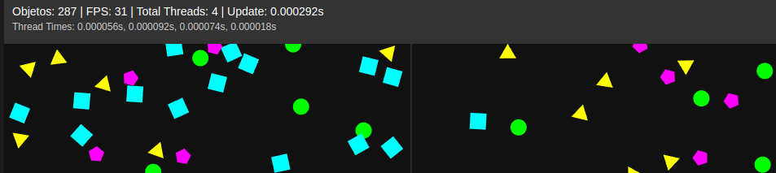

# 2d-space-multiprocess



# Simulador 2D de Física Multithreaded (Projeto SO)

Este repositório contém um simulador 2D de física distribuído em quadrantes, utilizando multithreading em C, servido via HTTP e acessível por um front-end HTML/JavaScript.

## Projeto

- Simulador de partículas/objetos em um campo 2D, com detecção de colisões (entre objetos e limites).
- Divisão da carga de processamento em quadrantes para cálculo paralelo de toda a área.
- Cada quadrante conta com uma *thread* responsável pelo processamento dos objetos dentro da subárea.
- O número de quadrantes pode ser ajustado em `include/manager.h` (constante `NUM_QUADRANTS`). Basta editar para utilizar mais ou menos threads.
- Interface visual que permite clicar para criar objetos com velocidade aleatória e visualizar estatísticas em tempo real.

## Deploy (CI/CD)

- O jogo está disponível automaticamente em http://167.235.75.94:8080/.
- Devido a limitações de rede da VPS, a atualização em tempo real pode apresentar atrasos; recomenda-se executá-lo localmente para obter melhor desempenho e experiência.


## ⚙️ Dependências

- **Compilador C**: GCC (suporte a C99 ou superior)
- **Make**: para automação de build (`make`)
- **Bibliotecas**:
  - `-pthread` para threads POSIX
  - `-lm` para funções matemáticas (`sqrt`, `fmin`)
- **Docker (opcional)**: criar imagem e rodar container

## 🛠️ Como compilar e executar

### Localmente com Make

```bash
# Clonar o repositório
git clone https://github.com/j4marcos/2d-space-cells.git
cd 2d-space-cells

# Build
make clean      # limpa objetos antigos
make            # compila todos os módulos e gera o executável 'simulacao'

# Executar
./simulacao     # inicia o simulador e o servidor HTTP na porta 8080
```

Pronto! agora pode acessar por http://localhost:8080

### Usando Docker Compose

```bash
# Iniciar container (porta 8080)
docker compose up -d
```

## 🚀 Instruções de uso

1. Abra o navegador em `http://localhost:8080`.
2. O canvas exibe o campo de física. As estatísticas aparecem acima (nº de objetos, FPS, threads, tempos de processamento).
3. Clique em qualquer ponto do canvas para criar um novo objeto com velocidade aleatória.
4. Observe colisões entre objetos e com os limites.
5. Para encerrar, pare o processo (`Ctrl+C`) ou o container Docker.

## Limitações

- por causa do buffer overflow, o limite de objetos é 300.

## 🤝 Equipe

| Integrante               | Matrícula   | Responsabilidades               |
| ------------------------ | ----------- | ------------------------------- |
| JOÃO MARCOS CUNHA SANTOS | 20230013339 | Mecânica de colisões e servidor |
| RAFAEL DE FRANÇA SILVA   | 20230012654 | Dockerização e estilização      |
| KAIQUE BEZERRA SANTOS    | 20230013357 | Otimização de threads           |

## 📄 Licença

Este projeto está licenciado sob a [MIT License](LICENSE).

---
